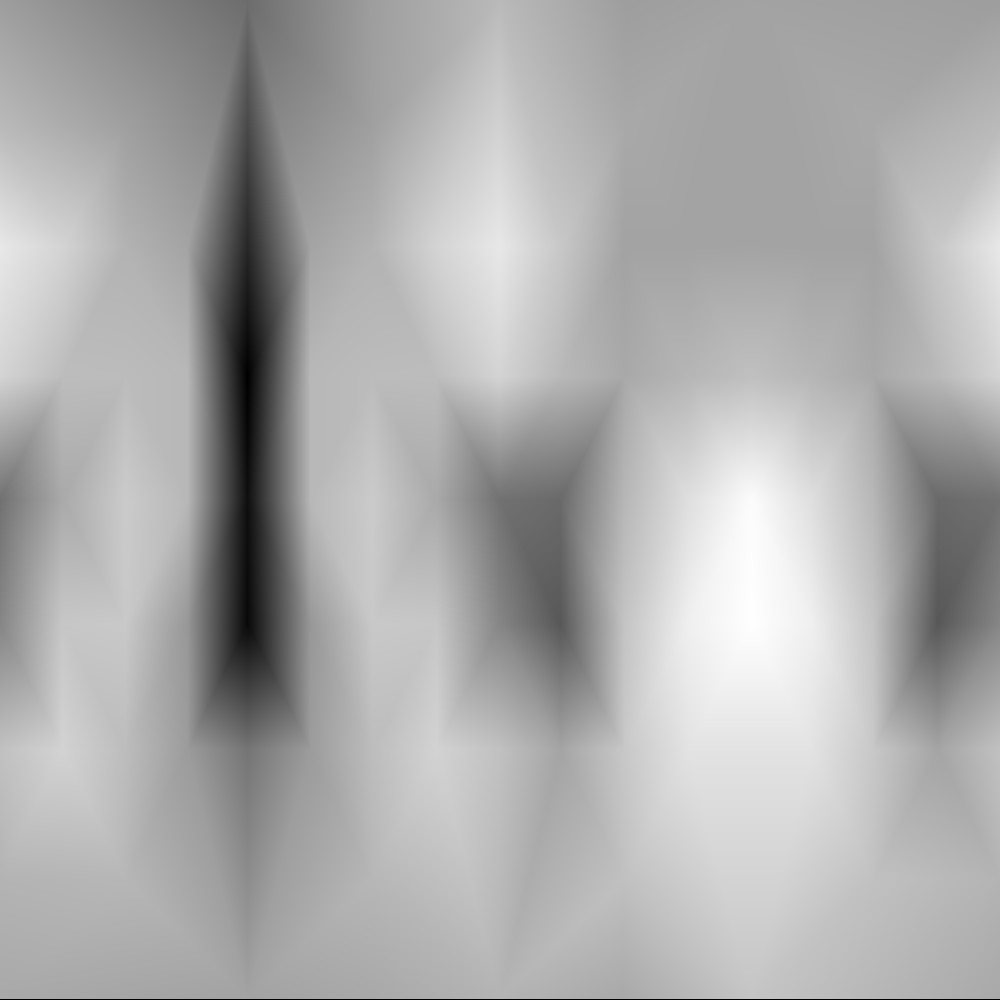
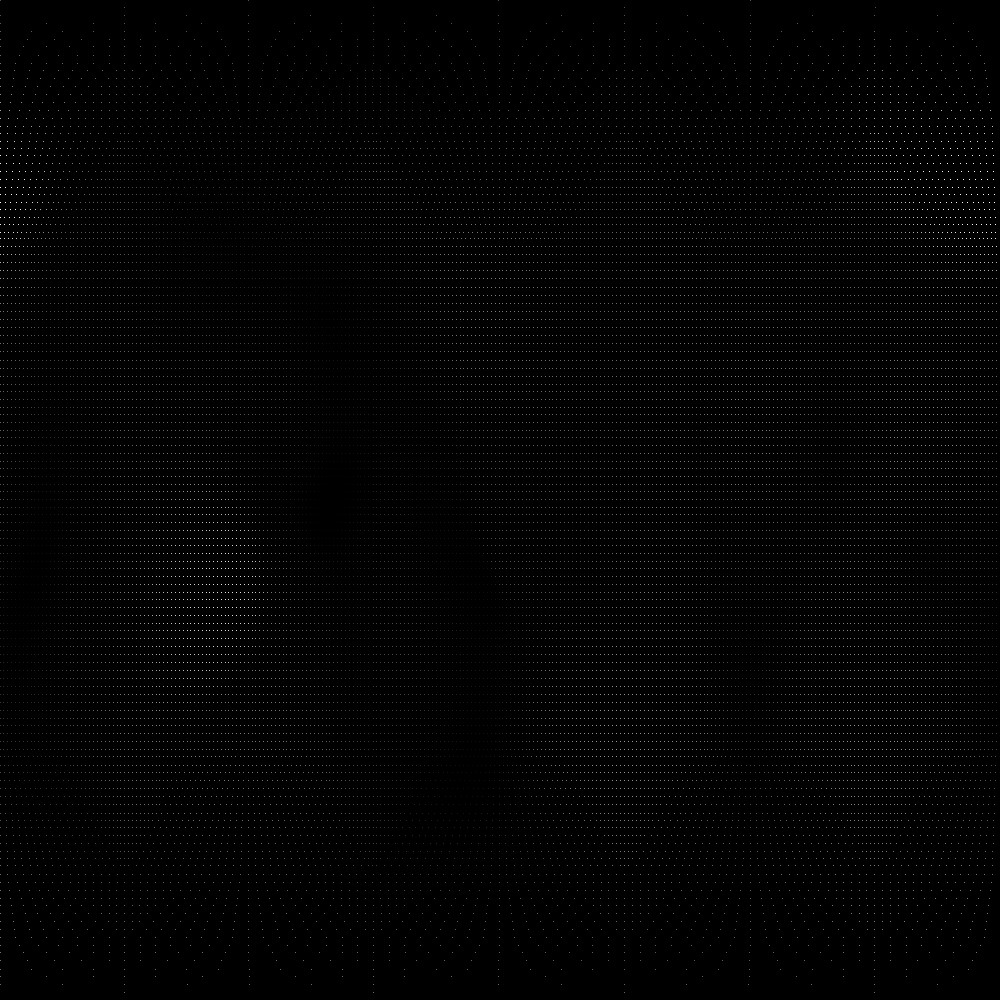
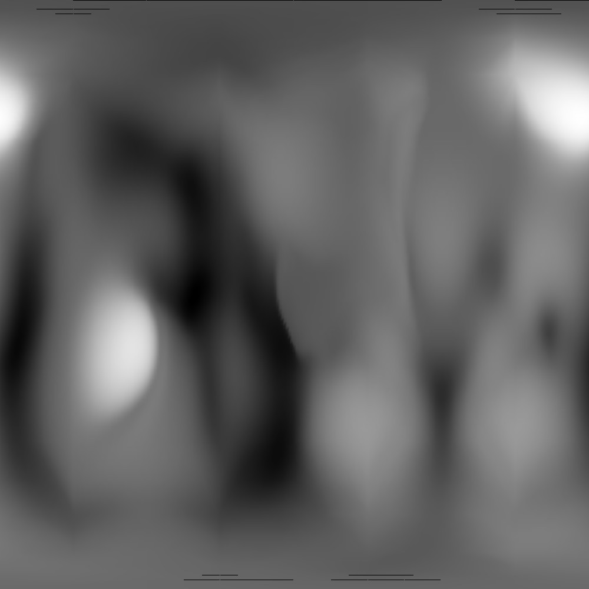

# Z-Mesh-Algorithm
This algorithm is used to interpolate between points in a 2-dimensional array, generating a hi-fidelity "image" from a low-fidelity set of data.

## Update
While very interesting, this algorithm is actually going to be abandoned in Muser because it has kind-of a horrendous running time, due to the fact that for each pixel in the image, 'find' is called on a map that has roughly 90k elements, leading to a running time of roughly O(10k * 90k). Using a rasterization technique instead I can lower it to roughly O(10k).

## Low Fidelity Data?
Below are examples to clarify what this actually means.
1. First, you can see the actual mesh object itself, this is what we are reading. The mesh object is loaded into the processing sketch, and the .obj data is parsed.

2. The second image is the output image if there is no algorithmic interpolation, just getting the data from the object and displaying it in a 2-Dimensional format (the brightness values of the point pixels is based on their distance from the center of the object). (**_Note: While the middle images below simply looks like blank images,  they aren't! Click it to see the original image, whereupon which you can see the non-interpolated data points._**)

3. The third image is the output image with the algorithmic interpolation.

As you can see, the algorithm allows me to create a high fidelity 2D image based off of a "low fidelity" set of data. I achieved this by using a tabulation technique because when working with meshes with a high number of vertices, any recursive technique very easily overflow the stack.

| Low Res 3D Model | Mesh data before algorithm | Mesh data after algorithm applied |
| --- | --- | --- |
|  |  |  |

| High Res 3D Model | Mesh data before algorithm | Mesh data after algorithm applied |
| --- | --- | --- |
|  |  |  |

This algorithm was designed and developed by myself as a way to generate a "spectrogram" that can be converted into sound within Muser.
